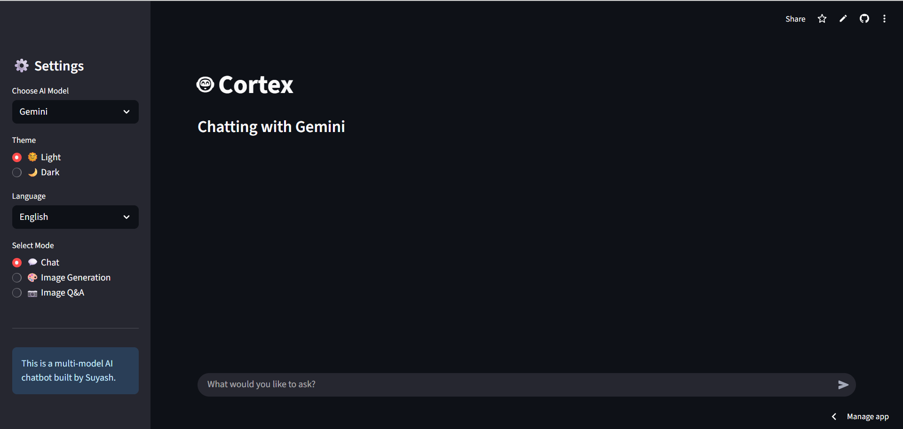

# Cortexa
Cortexa 🤖
Next-Gen Multi-Modal AI Chatbot Web App built with Streamlit
An intelligent, versatile, and user-friendly chatbot application that harnesses the power of multiple cutting-edge AI models. Cortexa provides a seamless interface for users to interact with different AI personalities, generate unique images from text, and analyze visual content—all within a clean web interface powered by Streamlit.

✨ Live Demo
<a href="https://cortexa-4aj8d8kk2fmizpmyvdaxhz.streamlit.app/" target="_blank">">

</a>
📸 Preview

🚀 Key Features
Multi-Model Text Chat: Switch between powerful AI models like Google Gemini and Groq on the fly.

🎨 Image Generation (Text-to-Image): Create stunning and unique images directly from your text descriptions.

🖼️ Image Analysis (Image-to-Text): Upload an image to get a detailed analysis and description from the AI.

Interactive Chat Interface: A clean, real-time, and intuitive chat UI built with Streamlit.

Chat History: Remembers your conversation history within a session.

Responsive Design: Works smoothly on both desktop and mobile browsers.

Secure API Handling: Uses Streamlit's secrets management to keep your API keys safe.

🛠️ Technology Stack
Frontend: Streamlit

Backend Logic: Python

AI Models:

Google Gemini Pro & Gemini Pro Vision (for text and image analysis)

Groq API (for high-speed text inference)

Image Generation Models (e.g., DALL-E 3, Stable Diffusion)

Deployment: Streamlit Cloud

⚙️ Getting Started
Follow these instructions to set up and run the project on your local machine.

Prerequisites
Python 3.9 or higher

Git for cloning the repository

Local Installation
Clone the repository:

Bash

git clone https://github.com/SuyashAdagale/Cortexa.git
cd Cortexa
Create and activate a virtual environment:

Bash

# For Windows
python -m venv venv
.\venv\Scripts\activate

# For macOS/Linux
python3 -m venv venv
source venv/bin/activate
Install the required dependencies:

Bash

pip install -r requirements.txt
Set up your environment variables:

Create a file named .env in the root directory of the project.

Add your API keys to this file:

GEMINI_API_KEY="your_gemini_api_key_here"
GROQ_API_KEY="your_groq_api_key_here"
# Add other keys like OPENAI_API_KEY if needed for image generation
Run the Streamlit app:

Bash

streamlit run app.py
The application will now be running on http://localhost:8501.

🚢 Deployment
This application is built to be easily deployed on Streamlit Cloud.

Push your code to a GitHub repository.

Log in to Streamlit Cloud and connect your GitHub account.

Click "New app", select your repository, and configure the main file path to app.py.

Important: Add your API keys in the "Secrets" section under "Advanced settings". Do not push your .env file to GitHub.

🗺️ Project Roadmap
[ ] Multi-model text chat (Gemini & Groq) - Done!

[ ] Image Generation (Text-to-Image) - In Progress

[ ] Image Analysis (Image-to-Text) - In Progress

[ ] User authentication to save chat history across sessions.Done

[ ] Ability to upload other file types (PDFs, etc.) for analysis.

[ ] Custom themes and UI improvements.

📄 License
This project is licensed under the MIT License. See the LICENSE file for more details.
